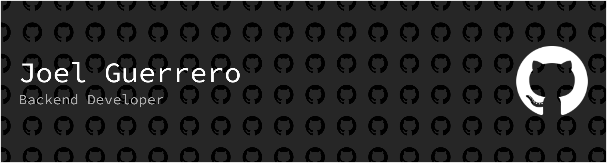

  

---

### 👤 Sobre mí
Desarrollador Backend con 4 años de experiencia especializado en la construcción de APIs escalables y seguras. Mi enfoque principal es la **Arquitectura Hexagonal** y la entrega de sistemas de alto rendimiento utilizando tecnologías modernas. Actualmente resido en **Madrid, España**.

---

### 🛠️ Tecnologías y Herramientas

**Backend & Frameworks**

**Mobile & Native Development**

**Bases de Datos y ORM**

**Infraestructura y Mensajería**

**Integraciones y DevOps**

**Especialidades**

---

### 🚀 Proyectos Recientes

* **Error codes generator (Nov 2025):** Extensión de VS Code diseñada para optimizar el flujo de trabajo gestionando códigos de error y nomenclaturas directamente en el editor.
* **Inventario Dual-Arch (Oct 2025 - Actualidad):** Proyecto de investigación que compara la implementación de sistemas bajo Arquitectura Modular vs. Arquitectura Hexagonal en NestJS.
* **Billing Engine:** Desarrollo de un motor de facturación robusto bajo principios de Arquitectura Hexagonal para asegurar el desacoplamiento y la escalabilidad.
* **Nest.JS + Microservicios (Aug 2025):** Creación de sistemas distribuidos utilizando múltiples bases de datos y transporte de datos para escalabilidad independiente.

---

### 💼 Experiencia Destacada

* **Desarrollador Backend en Chinchin:** Diseñé y desarrollé una API con seguridad multicapa (cifrado avanzado y biometría) que redujo el tiempo de integración bancaria en un 50%.
* **Fullstack Developer en Sitio Uno:** Lideré el desarrollo integral de una aplicación móvil SAAS en Java/Android enfocada en la administración eficiente de estacionamientos.

---

### 🎓 Educación y Certificaciones

**Formación Académica**
* 🎓 **T.S.U en Informática** - Tecnológico Américo Vespucio (2018-2021).

**Certificaciones Técnicas (Techminds Academy 2021-2024)**
* 📜 **NestJS / NestJS Modular:** Especialización en estructuras escalables.
* 📜 **MERN Stack:** Desarrollo Fullstack con MongoDB, Express, React y Node.
* 📜 **Mongo Database Administrator:** Gestión avanzada de bases de datos NoSQL.
* 📜 **Metodología SCRUM:** Gestión ágil de proyectos y trabajo en equipo.
* 📜 **Bases técnicas de Android & Diseño con Android Studio:** Desarrollo móvil nativo.
* 📜 **Diseño UX / UI:** Fundamentos de experiencia de usuario e interfaces.

**Otras Certificaciones**
* 📜 **Nest: Desarrollo backend escalable con Node** - Udemy (2024).

---

### 🌐 Idiomas
* **Español:** Nativo.
* **Inglés:** Nivel Intermedio.

---

  <i>Abierto a oportunidades locales en Madrid o posiciones remotas. ¡Hablemos!</i>

